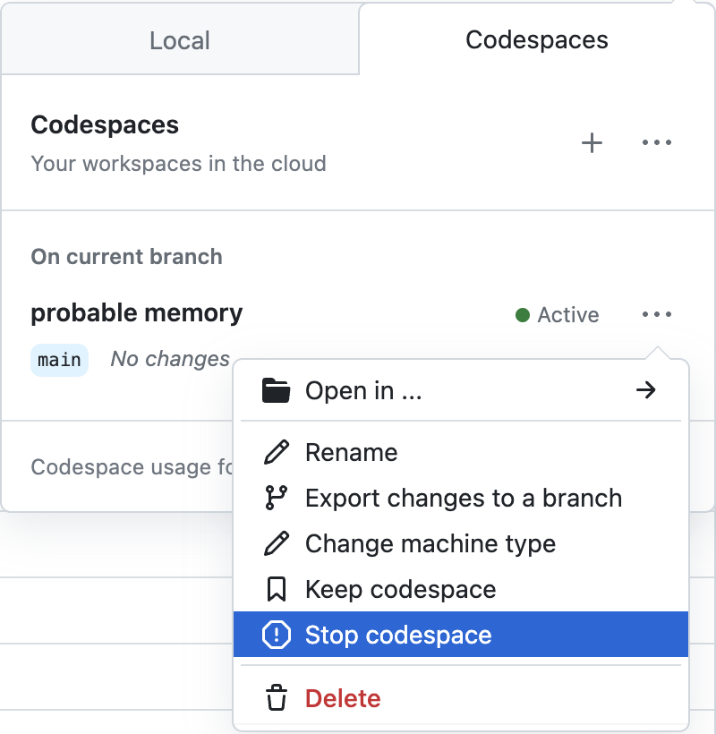

# Beyond the Basics: Data Visualization in Python

[](https://nbviewer.jupyter.org/github/Amarnath-Rao/python-data-viz-workshop/tree/main/) [](https://github.com/Amarnath-Rao/python-data-viz-workshop/actions/workflows/env-checks.yml)  [](https://amarnath-rao.github.io/python-data-viz-workshop/slides/html/workshop.slides.html#/)

The human brain excels at finding patterns in visual representations, which is why data visualizations are essential to any analysis. Done right, they bridge the gap between those analyzing the data and those consuming the analysis. However, learning to create impactful, aesthetically-pleasing visualizations can often be challenging. This session will equip you with the skills to make customized visualizations for your data using Python.

While there are many plotting libraries to choose from, the prolific Matplotlib library is always a great place to start. Since various Python data science libraries utilize Matplotlib under the hood, familiarity with Matplotlib itself gives you the flexibility to fine tune the resulting visualizations (e.g., add annotations, animate, etc.). This session will also introduce interactive visualizations using HoloViz, which provides a higher-level plotting API capable of using Matplotlib and Bokeh (a Python library for generating interactive, JavaScript-powered visualizations) under the hood.

## Workshop Outline


### Section 1: Getting Started With Matplotlib
We will begin by familiarizing ourselves with Matplotlib. Moving beyond the default options, we will explore how to customize various aspects of our visualizations. By the end of this section, you will be able to generate plots using the Matplotlib API directly, as well as customize the plots that libraries like pandas and Seaborn create for you.

### Section 2: Moving Beyond Static Visualizations
Static visualizations are limited in how much information they can show. To move beyond these limitations, we can create animated and/or interactive visualizations. Animations make it possible for our visualizations to tell a story through movement of the plot components (e.g., bars, points, lines). Interactivity makes it possible to explore the data visually by hiding and displaying information based on user interest. In this section, we will focus on creating animated visualizations using Matplotlib before moving on to create interactive visualizations in the next section.

### Section 3: Building Interactive Visualizations for Data Exploration
When exploring our data, interactive visualizations can provide the most value. Without having to create multiple iterations of the same plot, we can use mouse actions (e.g., click, hover, zoom, etc.) to explore different aspects and subsets of the data. In this section, we will learn how to use a few of the libraries in the HoloViz ecosystem to create interactive visualizations for exploring our data utilizing the Bokeh backend.


---

## Prerequisites
You should have basic knowledge of Python and be comfortable working in Jupyter Notebooks.  for a crash course in Python or work through the [official Python tutorial](https://docs.python.org/3/tutorial/) for a more formal introduction. The environment we will use for this workshop comes with JupyterLab, which is pretty intuitive, but be sure to familiarize yourself [using notebooks in JupyterLab](https://jupyterlab.readthedocs.io/en/latest/user/notebook.html) and [additional functionality in JupyterLab](https://dzone.com/articles/getting-started-with-jupyterlab). 

---

## Setup Instructions

You can work through the notebooks locally or in your browser. Pick the installation option that makes sense for you.

### Local Installation
**Warning**: It is highly recommended that you use your personal laptop for the installation.

0. Install [Anaconda](https://docs.anaconda.com/anaconda/install/)/[Miniconda](https://docs.conda.io/en/latest/miniconda.html) or [Mambaforge](https://mamba.readthedocs.io/en/latest/installation.html#fresh-install), if not already installed.
1. Fork this repository:

    

2. Navigate to your fork, and click the **Code** button:

    

3. Clone your forked repository using the desired method from the **Local** tab:

    

4. Create and activate a conda virtual environment (on Windows, these commands should be run in **Anaconda Prompt**):

    ```shell
    $ cd python-data-viz-workshop
    ~/python-data-viz-workshop$ conda env create --file environment.yml
    ~/python-data-viz-workshop$ conda activate data_viz_workshop
    (data_viz_workshop) ~/python-data-viz-workshop$
    ```

    *Note: If you installed Mambaforge or have already installed `mamba` in your base environment, you can change `conda env create` to `mamba env create`.*

5. Launch JupyterLab:

    ```shell
    (data_viz_workshop) ~/python-data-viz-workshop$ jupyter lab
    ```

6. Navigate to the `0-check_your_env.ipynb` notebook in the `notebooks/` folder:

    

7. Run the notebook to confirm everything is set up properly:

    

### Cloud Options

#### GitHub Codespaces

[](https://codespaces.new/Amarnath-Rao/python-data-viz-workshop)

The [GitHub Codespaces](https://github.com/features/codespaces) setup provides a pre-configured machine accessible via your browser. You will need a GitHub account and available quota (all users get more than enough free monthly quota to be able to run this workshop). Note that this will take a while to build. It's recommended that you click the badge above to build the codespace in advance of the workshop and then [stop the codespace](https://docs.github.com/en/codespaces/developing-in-codespaces/stopping-and-starting-a-codespace) until the workshop, at which point you can simply resume and pick up where you left off.

Note that if you want to save your changes, you will need to fork the repository before creating the codespace. You will then be able to commit your changes directly from the codespace. Be sure to create your codespace in advance of the session and resume when we start.

1. Fork this repository:

    

2. Navigate to your fork, and click the **Code** button:

    

3. Launch the codespace from your fork by clicking on the **+** or **Create codespace on main** button in the **Codespaces** tab:

    

4. Stop the codespace until the session starts by selecting **Stop codespace** from the **...** menu.

    

5. To resume the codespace, click **Open in ...** and then select your preferred method. If you aren't sure, select JupyterLab.

    


## Related Content
All examples herein were developed exclusively for this workshop. [Hands-On Data Analysis with Pandas](https://www.amazon.com/dp/1800563450/) contains additional examples and exercises